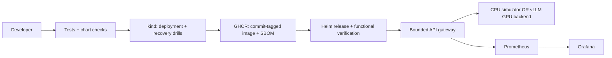

# ModelOps

**Ship an AI service. Prove you can operate it.**

[](https://github.com/pranaysparihar/model-ops/actions/workflows/ci.yml)

ModelOps is a DevOps/SRE reference implementation for a small team moving an AI API from a developer's machine to a shared service. Its purpose is to reduce manual deployment work, bound failures, and make recovery repeatable.

The engineering question is: **Can a developer release a change, detect a broken rollout, restore the previous version, and explain the service's reliability using evidence?**

This is a working local lab and a GPU deployment profile, not a claim of production traffic or uptime. The default backend is explicitly a deterministic CPU simulator. vLLM is the upstream inference engine in the optional GPU profile; ModelOps owns the gateway, delivery workflow, monitoring configuration, and recovery exercises.

## What it does

- Authenticated, non-streaming OpenAI-compatible completion gateway with per-replica concurrency limits, capped input/output, and hard backend deadlines.
- Docker Compose environment with Prometheus and a provisioned Grafana dashboard.
- Helm deployment with two gateway replicas, resource budgets, readiness/liveness separation, disruption budget, and backend ingress policy.
- Safe release script: readiness failure rolls back via Helm; functional smoke failure restores the previous deployed revision.
- CI creates a disposable Kubernetes cluster, deploys the service, attempts a deliberately broken release, checks functional-failure rollback, replaces a backend pod, and verifies a real completion.
- CI scans the gateway image for fixable high/critical vulnerabilities. Successful main-branch verification publishes a commit-tagged container and SBOM to GHCR. A separate manual staging workflow deploys only a revision with a successful CI run.
- A request-based SLO definition, alert rules, operational runbook, and explicit cost/capacity trade-offs.



## Try it locally — no GPU or cloud account

Requires Docker with Compose, Python 3, and Make. Ports bind to loopback only.

```sh
git clone https://github.com/pranaysparihar/model-ops.git
cd model-ops
make up
make smoke
make load
```

- API: http://localhost:8080
- Dashboard: http://localhost:3000/d/modelops
- Metrics and alert state: http://localhost:9090

`make up` creates a random key in ignored `.env`. `make smoke` checks readiness and sends an authenticated completion. `make load` prints HTTP status counts and full-response latency; 429 responses under overload are expected and counted against the availability objective.

```sh
set -a; . ./.env; set +a
curl http://localhost:8080/v1/chat/completions \
  -H "Authorization: Bearer $API_KEY" -H 'Content-Type: application/json' \
  -d '{"model":"demo-model","messages":[{"role":"user","content":"Hello"}],"max_tokens":16}'
```

## Demonstrate delivery and recovery

Requires kind, kubectl, Helm 3 or 4, Docker, and Python 3. Creates only the named `modelops-lab` cluster. `kind` selects its kube context; scripts always pass the explicit context to mutations.

```sh
make kind
make drill       # broken image rollback, backend replacement, completion verification
make monitoring  # optional in-cluster Prometheus + Grafana
kubectl --context kind-modelops-lab -n modelops port-forward svc/modelops-grafana 3001:3000
```

Drill logs are saved under ignored `artifacts/`; CI uploads them as `recovery-evidence`. Read [the runbook](docs/runbook.md) before applying the same procedures to a real environment.

## Use a real model

The [GPU profile](deploy/environments/gpu.yaml) selects vLLM and one NVIDIA GPU. It requires a GPU-enabled Kubernetes cluster, the NVIDIA device plugin, matching node labels, a default storage class, and access to the model registry. This profile is rendered and structurally checked in CI; it needs hardware validation before use. Model licenses are separate from this repository's MIT license.

See [deployment instructions](docs/deployment.md). No cloud account is selected or charged by the local setup.

## Intent, evidence, and boundaries

| Concern | Implementation | Evidence |
|---|---|---|
| Repeatable release | Helm + commit-tagged images | CI installation and smoke check |
| Bad rollout | readiness + functional rollback | deliberate missing-image drill |
| Backend loss | reconciliation and readiness removal | replacement pod UID + completion |
| Capacity exhaustion | immediate 429 + bounded in-flight calls | concurrency tests + load report |
| Stuck backend | overall request deadline | timeout tests, gauge returns to zero |
| Explainability | bounded metrics, request IDs, no prompt logging | metrics and log assertions |

[Architecture and trade-offs](docs/architecture.md) · [SLOs](docs/slos.md) · [Runbook](docs/runbook.md) · [Validation record](docs/validation.md)

### Deliberate limits

- This release supports text, **non-streaming** completions only. It does not measure time-to-first-token.
- One backend replica is a single point of failure; the pod recovery drill demonstrates recovery, not uninterrupted inference. A gateway replica count of two does not make the model highly available.
- Concurrency is bounded per gateway process. Run one worker per pod; total upstream concurrency is approximately replicas × limit. There is no shared queue or per-user quota.
- Monitoring storage is ephemeral and alert delivery is not configured. Prometheus evaluates rules; routing notifications needs an Alertmanager receiver owned by the operator.
- Services are private ClusterIP/localhost. Internet deployment needs TLS, ingress path restrictions, tenant identity, quotas, and network controls. Do not expose `/metrics` publicly.
- kind's default CNI does not enforce NetworkPolicy. The policy must be validated with the CNI used by the target cluster.
- No automatic GPU scaling, multi-tenancy, distributed rate limiting, or cloud provisioning is claimed. The current infrastructure target is reproducible local Kubernetes; choose a provider before adding Terraform.

## Development

```sh
python3 -m venv .venv
. .venv/bin/activate
pip install -r requirements-dev.txt
make test
```

Keep `deploy/chart/files/{alerts.yml,dashboard.json}` synchronized with their sources in `observability/`; CI checks this. See [CONTRIBUTING.md](CONTRIBUTING.md).

Cleanup: `make down` stops Compose; `make clean-lab` deletes only the disposable kind cluster. Keep `.env` out of version control.

## Attribution

ModelOps integrates [vLLM](https://github.com/vllm-project/vllm), [Kubernetes](https://kubernetes.io), [Helm](https://helm.sh), [Prometheus](https://prometheus.io), and [Grafana](https://grafana.com). Their code and licenses remain upstream. ModelOps does not claim authorship of an inference engine or training a model.
