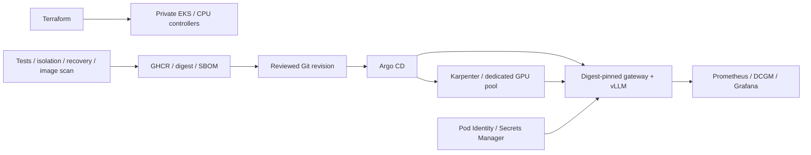

# ModelOps

**Infrastructure for operating a private GPU inference service.**

[](https://github.com/pranaysparihar/model-ops/actions/workflows/ci.yml)

ModelOps gives a small team a repeatable path from a model container to a controlled GPU service: AWS infrastructure, workload identity, GitOps delivery, GPU scheduling, resource isolation and operational evidence. vLLM supplies inference; this project owns the infrastructure around it.

**Intent:** replace hand-configured GPU servers and ad hoc releases with a platform whose access, capacity, cost and recovery decisions an operator can explain. [Hiring research and engineering decisions](docs/hiring-signal.md) map the work to requirements in platform and GPU infrastructure roles.

## What is implemented

| Layer | Implementation |
|---|---|
| AWS infrastructure | Terraform: two-AZ VPC, private EKS workers, system node group, access entries, flow logs, protected remote state |
| Workload identity | EKS Pod Identity for controllers; External Secrets can read only the gateway secret; no API secret in Terraform state |
| GPU capacity | Karpenter pool, reviewed NVIDIA AMI, dedicated taints, GPU quota, empty-node consolidation, explicit capacity/cost trade-offs |
| GPU operations | GPU Operator with one driver owner, DCGM dashboards and tested alerts, pending-pod/driver/memory runbooks |
| Delivery | Argo CD projects and controller applications, manually promoted chart SHA + image digest, CI-generated SBOM/provenance |
| Isolation | Restricted Pod Security, namespace resource quota, default-deny ingress and explicit service paths |
| Verification | Mocked Terraform plans, chart contract tests, real Cilium enforcement/admission tests and existing rollback/recovery drills |

**Evidence boundary:** local Kubernetes, network enforcement, admission, gateway behavior and Terraform mock tests have been exercised. The EKS/GPU configuration still requires cloud and hardware acceptance. No GPU benchmarks, cost savings, production traffic or uptime are claimed. The CPU simulator is explicitly a test fixture.



[Cloud platform guide](docs/cloud-platform.md) · [GPU incident runbook](docs/gpu-runbook.md) · [Validation evidence](docs/validation.md)

## Test the infrastructure without an AWS account

```sh
# Requires Terraform >=1.10, Helm, Python test dependencies.
for root in infra/state infra/aws; do
  terraform -chdir="$root" init -backend=false
  terraform -chdir="$root" validate
  terraform -chdir="$root" test
done
pytest -q tests/test_platform.py

# Docker + kind: real Cilium enforcement, GPU quota and Pod Security admission.
# Creates and cleans up only the named modelops-policy cluster.
./scripts/infra/policy-lab.sh
```

The quota test reserves an abstract GPU resource on a CPU cluster. It proves admission, not GPU scheduling. [AWS setup](docs/cloud-platform.md) is a separate, operator-run procedure with real costs; these tests never provision AWS.

## Try it locally — no GPU or cloud account

Requires Docker with Compose, Python 3, and Make. Ports bind to loopback only.

```sh
git clone https://github.com/pranaysparihar/model-ops.git
cd model-ops
make up
make smoke
make load
```

- API: http://localhost:8080
- Dashboard: http://localhost:3000/d/modelops
- Metrics and alert state: http://localhost:9090

`make up` creates a random key in ignored `.env`. `make smoke` checks readiness and sends an authenticated completion. `make load` prints HTTP status counts and full-response latency; 429 responses under overload are expected and counted against the availability objective.

```sh
set -a; . ./.env; set +a
curl http://localhost:8080/v1/chat/completions \
  -H "Authorization: Bearer $API_KEY" -H 'Content-Type: application/json' \
  -d '{"model":"demo-model","messages":[{"role":"user","content":"Hello"}],"max_tokens":16}'
```

## Demonstrate delivery and recovery

Requires kind, kubectl, Helm 3 or 4, Docker, and Python 3. Creates only the named `modelops-lab` cluster. `kind` selects its kube context; scripts always pass the explicit context to mutations.

```sh
make kind
make drill       # broken image rollback, backend replacement, completion verification
make monitoring  # optional in-cluster Prometheus + Grafana
kubectl --context kind-modelops-lab -n modelops port-forward svc/modelops-grafana 3001:3000
```

Drill logs are saved under ignored `artifacts/`; CI uploads them as `recovery-evidence`. Read [the runbook](docs/runbook.md) before applying the same procedures to a real environment.

## Use a real model

The [GPU profile](deploy/environments/gpu.yaml) selects vLLM and one NVIDIA GPU. It requires a GPU-enabled Kubernetes cluster, the NVIDIA device plugin, matching node labels, a default storage class, and access to the model registry. This profile is rendered and structurally checked in CI; it needs hardware validation before use. Model licenses are separate from this repository's MIT license.

The AWS path adds GPU capacity and controller configuration; see [the cloud platform guide](docs/cloud-platform.md). The independent existing-cluster path is documented in [deployment instructions](docs/deployment.md). No cloud account is selected or charged by the local setup.

## Intent, evidence, and boundaries

| Concern | Implementation | Evidence |
|---|---|---|
| Repeatable release | Helm + commit-tagged images | CI installation and smoke check |
| Bad rollout | readiness + functional rollback | deliberate missing-image drill |
| Backend loss | reconciliation and readiness removal | replacement pod UID + completion |
| Capacity exhaustion | immediate 429 + bounded in-flight calls | concurrency tests + load report |
| Stuck backend | overall request deadline | timeout tests, gauge returns to zero |
| Explainability | bounded metrics, request IDs, no prompt logging | metrics and log assertions |

[Architecture and trade-offs](docs/architecture.md) · [SLOs](docs/slos.md) · [Runbook](docs/runbook.md) · [Validation record](docs/validation.md)

### Deliberate limits

- This release supports text, **non-streaming** completions only. It does not measure time-to-first-token.
- One backend replica is a single point of failure; the pod recovery drill demonstrates recovery, not uninterrupted inference. A gateway replica count of two does not make the model highly available.
- Concurrency is bounded per gateway process. Run one worker per pod; total upstream concurrency is approximately replicas × limit. There is no shared queue or per-user quota.
- Monitoring storage is ephemeral and alert delivery is not configured. Prometheus evaluates rules; routing notifications needs an Alertmanager receiver owned by the operator.
- Services are private ClusterIP/localhost. Internet deployment needs TLS, ingress path restrictions, tenant identity, quotas, and network controls. Do not expose `/metrics` publicly.
- The original kind lab's default CNI does not enforce NetworkPolicy. The separate Cilium lab proves local ingress enforcement; AWS VPC CNI still needs its own acceptance test.
- Karpenter node provisioning is configured but not cloud-tested. Request-driven model autoscaling, complete hostile multi-tenancy and distributed rate limiting are outside this release.

## Development

```sh
python3 -m venv .venv
. .venv/bin/activate
pip install -r requirements-dev.txt
make test
```

Keep `deploy/chart/files/{alerts.yml,dashboard.json}` synchronized with their sources in `observability/`; CI checks this. See [CONTRIBUTING.md](CONTRIBUTING.md).

Cleanup: `make down` stops Compose; `make clean-lab` deletes only the disposable kind cluster. Keep `.env` out of version control.

## Attribution

ModelOps integrates [vLLM](https://github.com/vllm-project/vllm), [Kubernetes](https://kubernetes.io), [Helm](https://helm.sh), [Prometheus](https://prometheus.io), and [Grafana](https://grafana.com). Their code and licenses remain upstream. ModelOps does not claim authorship of an inference engine or training a model.
