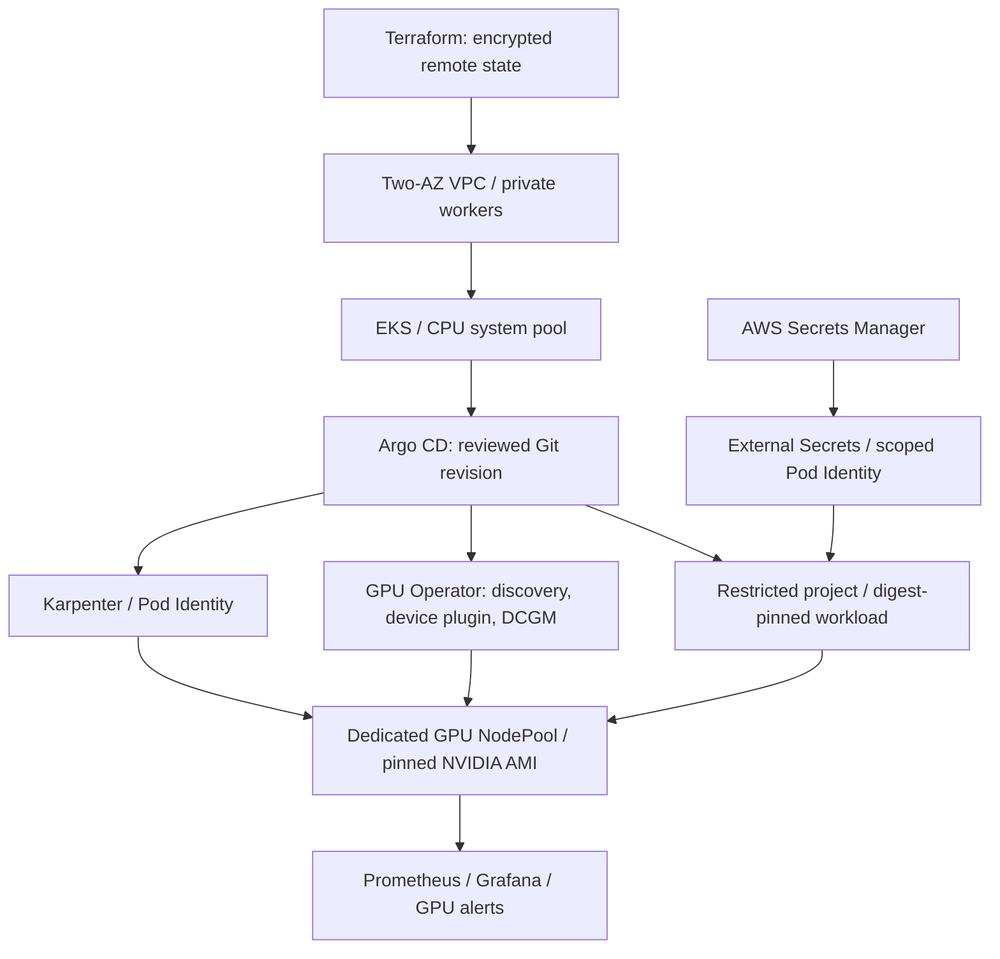

# Operating the AWS GPU platform

This is an implemented reference configuration, with local and mocked validation. Cloud provisioning, Argo reconciliation on EKS, GPU initialization, and AWS VPC CNI enforcement still need a real environment acceptance run.

## Layout and ownership



Terraform owns AWS; the root Argo Application owns platform controllers, namespace policies and child Applications. The workload Application owns the gateway and model server. Do not run the standalone Helm deployment script against an Argo-managed release: two reconcilers would compete.

`modelops-platform` is deliberately cluster-admin capable and operator-owned. `modelops-workloads` permits a narrow resource allowlist only inside the modelops namespace. This is one tenant's resource/access boundary, not a complete hostile multi-tenant platform. Egress remains open for model downloads and AWS endpoints; ingress is denied by default with specific exceptions. Monitoring can reach backend metrics and the backend API on the same port; the monitoring namespace is trusted.

## Prerequisites and cost decision

Use an AWS account you control, Terraform >=1.10, AWS CLI with short-lived SSO/role credentials, kubectl, Helm, and Python. Do not commit AWS credentials, state, kubeconfigs or secret manifests. Determine EKS Kubernetes/add-on availability, EC2 GPU quotas and AMI compatibility in the chosen region before approving a real plan.

The default creates two m6i.large system nodes, EKS, one NAT gateway, logs and storage before any GPU is started. `monthly_budget_usd=100` is an example alert threshold, **not an estimate or enforced cap**. Price the plan using [AWS Pricing Calculator](https://calculator.aws/) and choose a deletion date. A single NAT trades AZ resilience for cost; `ha_nat=true` uses per-AZ gateways. Monitoring uses ephemeral storage and no external alert receiver. One GPU model replica has downtime during replacement/release. Do not describe this lab as highly available.

## Provisioning procedure (operator-run; incurs AWS charges)

1. Create a unique remote-state bucket with `infra/state`; its versioning, public access block, TLS-only policy and deletion protection are explicit. This bootstrap initially has local state: keep it secure, then migrate it to a separate key in the protected bucket. Do not discard its state.
2. Copy `infra/aws/backend.hcl.example` to ignored `backend.hcl`, and `terraform.tfvars.example` to ignored `terraform.tfvars`. Set region, existing operator role and budget recipient. Defaults keep the cluster API private: use a workstation/runner connected to the VPC, or deliberately allowlist your exact IPv4 `/32`. There is no implicit cluster-creator admin grant.
3. Run `terraform init -backend-config=backend.hcl`, `terraform plan -out=reviewed.tfplan`; inspect resources, IAM and costs before `terraform apply reviewed.tfplan`. Keep plans private because they may contain state-derived data. Capture the provider lockfile and pin supported add-on versions after review.
4. Populate the created Secrets Manager secret outside Terraform using a secure secret-string file or your secret manager. Terraform manages only metadata, never the API key value. Use the secret ARN from outputs. The ESO identity can read only that secret.
5. Configure kubectl using the named EKS cluster and authorized operator role. Verify the intended context before any mutation.

The scripts never run Terraform apply. CI uses mocked providers without AWS credentials.

## GitOps bootstrap

`terraform -chdir=infra/aws output -json platform_values` returns non-secret identifiers for the `cloud` mapping in `platform/environments/aws.example.yaml`. Copy the example to `aws.yaml`, fill those identifiers, and commit the reviewed file. Start with `gpu.enabled=false` and `workload.enabled=false`. Environment identifiers are safe to version; secret values are not.

ModelOps is public, so Argo CD needs no Git credential to fetch this repository. For a private repository, follow [Argo CD's declarative repository setup](https://argo-cd.readthedocs.io/en/stable/operator-manual/declarative-setup/#repositories) and use a dedicated read-only GitHub App/token credential. Keep secret manifests outside Git. GitHub repository visibility and GHCR package visibility are independent; a private container package still needs the image-pull credential described below.

```sh
export KUBE_CONTEXT=your-explicit-eks-context
export PLATFORM_VALUES=environments/aws.yaml
export PLATFORM_REVISION=FULL_REVIEWED_GIT_COMMIT_SHA
./scripts/bootstrap-platform.sh
kubectl --context "$KUBE_CONTEXT" -n argocd get applications
```

The root is pinned to a reviewed commit, not a moving branch. After merging environment changes, rerun bootstrap with the new commit to advance the root. Controller versions are separately pinned. Child Application health customization makes sync waves wait for controller readiness before dependent resources. Argo and Grafana remain ClusterIP services; access them by explicit port-forward. Grafana's random credential is held in `monitoring/grafana-admin`; Argo's initial password follows upstream bootstrap behavior. Rotate credentials and add SSO before a shared environment.

## Enable the GPU pool and promote a model

1. Resolve a region/version-compatible **EKS AL2023 x86_64 NVIDIA AMI**, review it, and set its exact `gpu.amiID`. Set `gpu.enabled=true` in a reviewed environment commit. No AMI `latest` alias is used. Default g5.xlarge/g6.xlarge instances have one GPU; no MIG/time-slicing is configured.
2. Check Karpenter, its EC2NodeClass and GPU Operator health. GPU Operator's driver/toolkit installation is disabled because the AMI already supplies them. NFD and GPU daemons tolerate the dedicated pool taint.
3. Use a successful main-branch CI run's `image-identity` artifact. The **Prepare GitOps promotion** workflow verifies that CI succeeded and creates an artifact containing the full chart commit and registry digest. It receives no cluster credentials. Merge `workload.imageTag` and `workload.imageDigest` into the environment values, set `workload.enabled=true`, and review the Git diff. `imageTag` pins the chart source; the image is pulled by digest.
4. For private GHCR packages, provision `modelops/ghcr-pull` using a read-only package credential. This credential is separate from Argo's Git credential. The namespace should already exist after platform bootstrap.
5. Advance the root revision, inspect the workload Application diff, then manually sync `modelops-inference` through Argo. Automatic workload sync is deliberately disabled. Karpenter should react to its unschedulable GPU pod, launch a matching node, and the EBS CSI driver should place its cache volume in that node's AZ.
6. Port-forward the gateway, set `API_KEY` and `BASE_URL` in your local environment, then run `python3 scripts/infra/gpu-acceptance.py`. It refuses a simulator backend, verifies GPU allocation and `nvidia-smi`, and makes a real authenticated completion. Save the resulting hardware evidence only after review/redaction of account-specific identifiers.
7. Verify DCGM targets and alerts separately, then exercise node loss and cold-start recovery during a planned test window. Do not claim benchmark or cost results from the readiness check.

If functional acceptance fails, revert the environment's chart SHA **and image digest** to the previously verified pair, advance the root, and manually sync the workload. Inspect Argo diff and volume/model compatibility before rollback. The existing automated Helm rollback drill applies to the independent local lab; it is not an automatic rollback controller for Argo.

## Cost controls and shutdown

Karpenter has a one-GPU target limit, a small instance allowlist and empty-node consolidation after five minutes. Limits are eventually consistent; they are not hard spending caps. Namespace admission enforces one requested GPU. The backend uses Recreate to avoid needing a second GPU during a release; the gateway remains rolling.

To stop GPU use, review and commit `workload.replicas=0`, advance the root, then manually sync the workload. Karpenter can consolidate the now-empty node; verify it actually terminates in EC2. System nodes, NAT, EKS, EBS cache and logs continue costing money. An idle-but-running model pod prevents empty-node consolidation. There is no traffic-driven autoscaler in this release.

For full teardown, first scale workloads to zero and verify GPU NodeClaims/instances are gone while Karpenter is still running. Inspect and explicitly remove retained workload/PVC/Application resources using Argo; Applications intentionally have no cascading deletion finalizer, so deleting the parent alone does not delete workloads. Then review `terraform destroy` for the AWS stack. Check orphan disks, logs and EC2 resources. The state bucket has deliberate deletion protection and remains separate. Do not force-remove finalizers or state to make destruction appear successful.

## Upstream references

- [AWS: EKS accelerated AMIs](https://docs.aws.amazon.com/eks/latest/userguide/ml-eks-optimized-ami.html)
- [EKS Terraform module: Karpenter example](https://github.com/terraform-aws-modules/terraform-aws-eks/blob/master/examples/karpenter/main.tf)
- [NVIDIA: DCGM exporter metrics](https://docs.nvidia.com/datacenter/dcgm/latest/reference/dcgm-exporter-metrics.html)
- [Karpenter disruption behavior](https://karpenter.sh/docs/concepts/disruption/)
